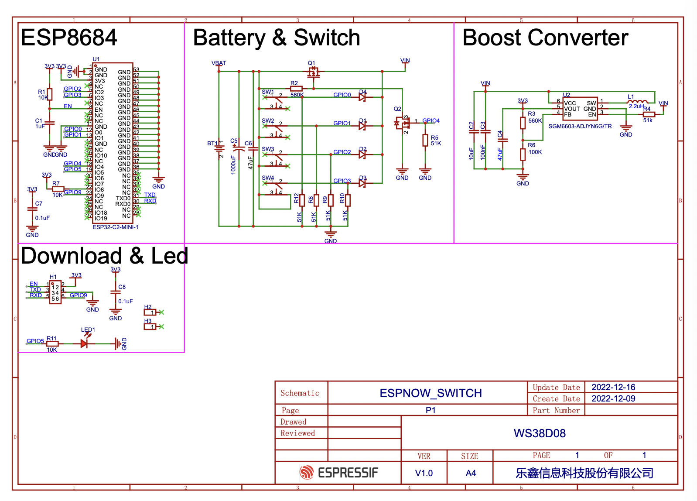

# Coin Cell Example

This example provides a low-power solution to achieve wireless control which has two sub-projects SWITCH (switch) and BULB (controlled end). The switch with a coin cell can be used to send 65000 packets and the actual lifetime is calculated to be 2.5 years if it is pressed 50 times a day and the receiver switches channels once a day.

## Functionality

### switch

The switch device sends the control commands to change the `RGB LED` status of the bulb devices. By default, the switch uses the coin cell button to control the bulb devices, but if you don't have such button, you can use other ESP32 series DevKit to simulate.

Open the project configuration menu (`idf.py menuconfig`) to set following configurations under `Example Configuration` Options: 

* Set `Use coin cell button` of example to `N` to simulate.

> Note: The device can only control the bound devices, so it must be bound before control.

### bulb

The bulb devices change the `RGB LED` status when receiving the control commands from switch devices.

## Hardware Required

### ESP32 series DevKit

This example can run on any ESP32 series boards and at least two development boards (for example: ESP32-C3-DevKitM-1) are required. 

- You need to use the `BOOT` button on the development boards as switch devices to simulate.
- You need to use `RGB LED` on the development boards as bulb devices to demonstrate.

### coin cell button

Switch example can run on coin cell button which uses ESP32C2 chip. The images below show the front and back view of the coin cell button.


You can reference the schematic as follows:


## How to Use the Example

#### ESP32 series DevKit

- Double click the `BOOT` button on the device, it will send the binding command.
- Single click the `BOOT` button on the device, it will send the control command.
- Long press (more than 1.5 seconds) the `BOOT` button on the device, it will send the unbinding command.

#### coin cell button

- Open the project and compile the firmware as default config.
- Connect the [ESP-Prog](https://espressif-docs.readthedocs-hosted.com/projects/esp-dev-kits/en/latest/other/esp-prog/index.html#) board and button use 2*3-PIN 1.27 mm male shrouded box header.
- Download the firmware by the command `idf.py -p /dev/ttyUSB1 flash` on Ubuntu or [Flash Download Tools](https://www.espressif.com/sites/default/files/tools/flash_download_tool_3.9.4.zip) on windows.
- Press and hold the key on the device for more than 2s, it will send the binding command.
- Click the key on the device, it will send the control command.
- Press and hold the key on the device for more than 4s, it will send the unbinding command.

Output sample from the switch:

```
app_switch: switch bind press
```

```
app_switch: switch send press
```

```
app_switch: switch unbind press
```

### bulb

- The devices receive the binding command, the `RGB LED` on these devices will turn green, indicating that the devices have been bound successfully.
- The devices receive the control command, the status of `RGB LED` (ON/OFF) will be controlled by the switch device, and the color will be white.
- The devices receive the unbinding command, the `RGB LED` on these devices will turn red, indicating that the devices have been unbound successfully.

> Note: Reboot the devices quickly also can unbind

Output sample from the bulb:

```
app_bulb: bind, uuid: 10:97:bd:f2:50:08, initiator_type: 513
```

```
app_bulb: app_bulb_ctrl_data_cb, initiator_attribute: 513, responder_attribute: 1, value: 0
app_bulb: app_bulb_ctrl_data_cb, initiator_attribute: 513, responder_attribute: 1, value: 1
```

```
app_bulb: unbind, uuid: 10:97:bd:f2:50:08, initiator_type: 513
```

## Other Applications

For application using the coin cell button to work with a [ESP-NOW Matter bridge](https://github.com/espressif/esp-matter/tree/main/examples/esp-now_bridge_light), refer to this [Application Note](switch/docs/button_in_matter_bridging.md).
