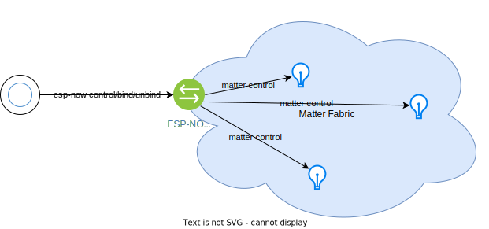
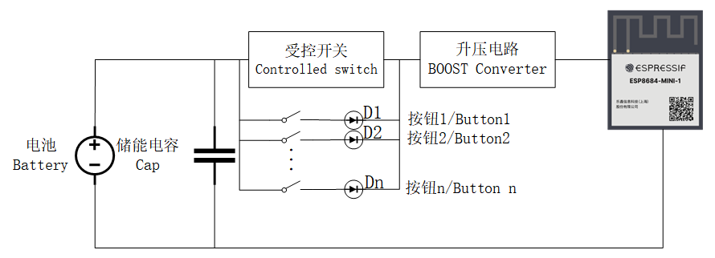
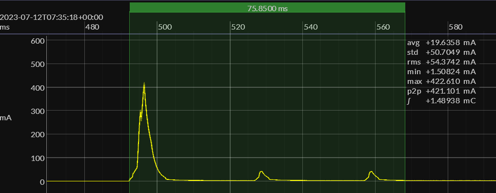
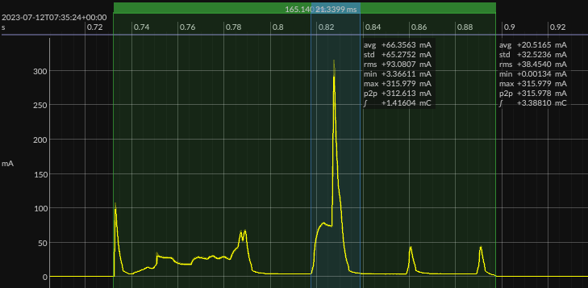
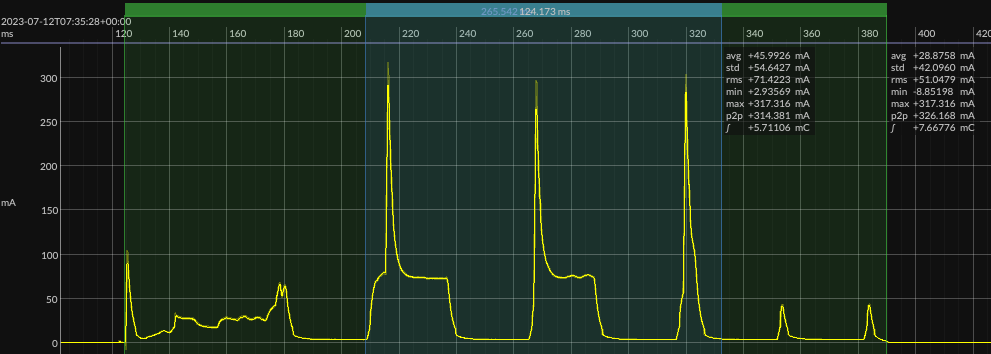
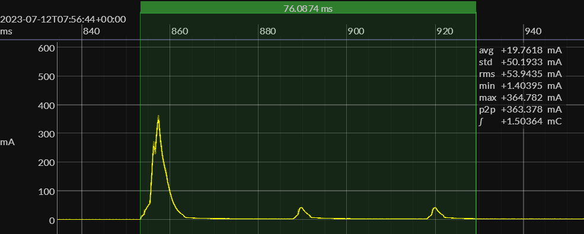
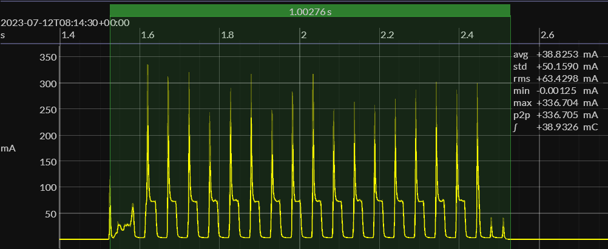
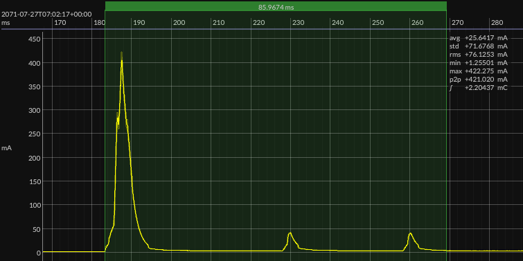
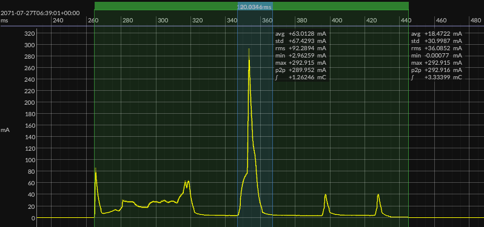
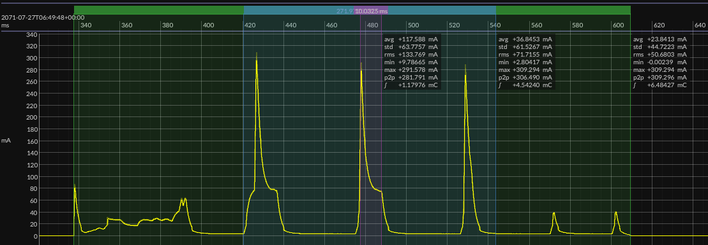

# Coin Cell Button in ESP-NOW Matter Bridging

## Overview

In the [ESP-NOW Matter bridge](https://github.com/espressif/esp-matter/tree/main/examples/esp-now_bridge_light) example, we are creating a Matter bridge that can bridge esp-now controls to devices inside a Matter fabric:


The coin cell button can be used in an initiator role to control the bridge in responder role.

Refer to [this document](./SCH_Cell_button_switch_ESP32C2.pdf) for the schematic diagram.

## Hardware Design

The diagram below shows a simplified hardware design of the coin cell button circuit.


From the diagram, it can be seen that the button is not a GPIO, instead it is the switch that controls the power supply of the coin cell button device, i.e., when the button is pressed, the device is powered on, and tasks are executed according to the software. When the button is released, power is totally cut off. In this hardware design, up to 5 buttons can be supported. By reading the voltage level on the IO port, software can identify which button is being pressed.

The power of the button is supplied by a power system consisting of a coin cell battery and a large capacitor. Both can only supply unstable power for a short period. There is additional circuitry ( Boost Converter) to stabilize and extend the power supply for additional period. However the power system is still considered limited. We should try to reduce the tasks for the device to perform. And the coin cell button needs to complete its task as fast as possible.

As the coin cell battery and the capacitor is connected, when button is released, there will still be a small current leakage. Based on the specification of the capacitor (refer to the [BOM](./BOM_Cell_button_switch_ESP32C2.xlsx) for details), the leakage is about 1.5$\mu$A.

## Software Design

### Configurations

A few configurations are applied to try to reduce the power consumption of the button device.

* `CONFIG_ESP_PHY_RF_CAL_NONE=y`: This disables the RF calibration during bootup.
* `CONFIG_LOG_DEFAULT_LEVEL_NONE=y`: This disables all logs.
* `CONFIG_ESPNOW_LIGHT_SLEEP=y`: This asks the device to enter light sleep before starting the next transmission.
* `CONFIG_ESPNOW_LIGHT_SLEEP_DURATION`: After ```CONFIG_ESPNOW_LIGHT_SLEEP``` is enabled, the duration can be set with this configuration. Default is 30ms.
* `CONFIG_ESPNOW_CONTROL_AUTO_CHANNEL_SENDING=y`: Enable auto channel switching. This feature needs to be enabled to support channel switching (see below).
* `CONFIG_ESPNOW_CONTROL_WAIT_ACK_DURATION=20`: Set timeout for waiting for acknowledgement as 20ms.
* `CONFIG_ESPNOW_CONTROL_RETRANSMISSION_TIMES=2`: Set retransmission count is 2, i.e. total maximum transmission of same data is 3.
* `CONFIG_ESPNOW_DATA_FAST_ACK=y`: When acknowledgement is reported by lower layer, call the handler callback immediately. This can greatly reduce the wait time for acknowledgement (`CONFIG_ESPNOW_CONTROL_WAIT_ACK_DURATION`).

### ESP-NOW Attributes

The ESP-NOW component defines an enum `espnow_attribute_t` to identify the type of control in both initiator and responder. Refer to `espnow_ctrl.h` for details.

In this application, the attribute `ESPNOW_ATTRIBUTE_KEY_1` on the initiator (button) is bound to the responder (ESP-NOW bridge) during binding. During control, button sends `ESPNOW_ATTRIBUTE_KEY_1` to bridge attribute `ESPNOW_ATTRIBUTE_POWER`.

> __Note__
 Currently, both attributes are hard-coded on both devices. In addition, on the ESP-NOW bridge, the two attributes are not checked in application level.

### Software Flow

After boot-up and initialization is complete, the button starts to execute a task as shown below.  Note however that the execution can stop anytime when the button is released.


#### Operations

The coin cell button can only perform on-off control to a bound responder. Following the software flow as described, the operations performed by the device are:

- Press the button on the device: send the control command.
- Press and hold the key on the device for more than 2s: send the binding command.
- Press and hold the key on the device for more than 4s: send the unbinding command.

### Channel Switching

Since the responder device ESP-NOW bridge is connected to an AP, the channel is fixed and determined by the AP it is connected to. On the other hand, the coin cell button is powered off most of the time. It won't be able to know on which channel the bridge is at the beginning or when AP has switched the operating channel.

In such scenario, the auto channel switching feature is required (`CONFIG_ESPNOW_CONTROL_AUTO_CHANNEL_SENDING`).

In ESP-NOW auto channel switching, the initiator device sends its command on a specific channel (either a saved channel or a default starting channel) and requires the responder to reply an acknowledgement when it receives the command. If the initiator does not receive acknowledgement after a timeout (`CONFIG_ESPNOW_CONTROL_WAIT_ACK_DURATION`), it considers the transmission as not successful. Then it tries to retransmit the command for a number of times (`CONFIG_ESPNOW_CONTROL_RETRANSMISSION_TIMES=2`). If still no acknowledgement is received, the initiator switches to other channels to send the command in the following sequence:

```c
[1, 6, 11, 1, 6, 11, 2, 3, 4, 5, 7, 8, 9, 10, 12, 13]
```

Channel 1, 6 and 11 are primary channels, so they are tried first, then followed by the rest of channels. All transmissions will follow with a timeout wait. If an acknowledgement is received on a channel, the initiator saves the channel for the next command transmission. If no acknowledgement is received, the initiator repeat this sequence again. If still no acknowledgement, the initiator stops without updating the channel. When sending a command next time, the initiator repeats the above flow.

As described in [bridge application note](https://github.com/espressif/esp-matter/tree/main/examples/esp-now_bridge_light/docs/esp-now-bridge-with-button.md), ESP-NOW power saving is enabled. The configurations are:

* Wake interval: 200ms
* Wake window: 110ms

The following configuration parameters need to be tuned to work with the bridge's configuration.

* `CONFIG_ESPNOW_LIGHT_SLEEP_DURATION`: 30ms
* `CONFIG_ESPNOW_CONTROL_WAIT_ACK_DURATION`: 20ms
* `CONFIG_ESPNOW_CONTROL_RETRANSMISSION_TIMES`: 2

As described in the bridge application note, with these configurations, it is guaranteed that one transmission on the saved channel can be received by the bridge in the wake interval. However, in the subsequent channel sequence, there is no continuous retransmission on each channel. Hence it is possible that the bridge may miss the coin cell button's command on these channels.

Considering the limited power that the coin cell button has, there may not be enough power for the button to perform 3 transmissions on each channels. We can try to optimize the reception with the following technics:

* continuous transmit twice on each channel. This increases the chances of getting response from the channels on the channel sequence but is still not guaranteed.
* Transmit 3 times on each channel in the channel sequence, but skip the one which is the saved channel as it has been tried before. This needs to be tested and verified if power is enough to run through till the last channel.

## Power Consumption

### Measurement and Analysis

The measurement below is based on the above configurations. The software versions are:

* ESP-NOW: v2.3.0
* IDF: release/v5.1, commit: 420ebd
* ESP-NOW Responder: [ESP-NOW Matter bridge](https://github.com/espressif/esp-matter/tree/main/examples/esp-now_bridge_light) in esp-matter commit 949044

#### Binding

As described in [Software Flow](#software-flow), before triggering a bind operation, there will always be a control command transmission. They are separated apart by 2s.


The transmission seems to take slightly more power than control. However since it is just one-time operation, it is not much of a concern. In this test, the binding channel happens to be the button's saved channel, so there is no channel switching.



#### Control

##### One Transmission

The figure below shows a typical control power consumption with 1 transmission, i.e. the responder receives and acknowledge the first transmission.



The total time from boot up to power off is about 165ms, with average current about 21mA. For the transmission alone, it takes about 21ms and average current about 66mA.

##### Three Transmissions

The figure below shows a power consumption involving retransmissions. It can be seen that there are a total of 3 transmissions.



Average consumption is about 29mA in 266ms. The 3 transmission is about 46mA in 124ms.

#### Unbind

The unbind power consumption is similar to bind.



#### Channel Switch

The figure below shows a channel switching scenario where AP switches channel to #10, which is almost the last channel to try in the sequence. When the button is pressed once, it performs retransmissions and transmissions on all channels in the sequence until it receives and acknowledgement.



Average consumption is about 39mA in 1s.

If AP switches channel frequently, it will have a big impact on the button's battery life.

#### Detailed Analysis on One Transmission

The figure below zooms in one transmission without receiving acknowledgement to analyze the power consumption.

The power consumption matches with the configuration values `CONFIG_ESPNOW_LIGHT_SLEEP_DURATION` (30ms) and `CONFIG_ESPNOW_CONTROL_WAIT_ACK_DURATION` (20ms). It is also to be noted that during light sleep, the device consumes about 3.5mA of current.


### Configuration Tuning

In the above measurement, we have the following configurations.

Coin Cell Button:

* `CONFIG_ESPNOW_LIGHT_SLEEP_DURATION`: 30ms
* `CONFIG_ESPNOW_CONTROL_WAIT_ACK_DURATION`: 20ms

ESP-NOW Matter Bridge:

* Wake interval: 200ms
* Wake window: 110ms

With these, we only need 2 retransmissions (total 3 transmissions) to cover one sleep interval on the bridge (refer to the calculation in [bridge application note](https://github.com/espressif/esp-matter/tree/main/examples/esp-now_bridge_light/docs/esp-now-bridge-with-button.md) for details):

* `CONFIG_ESPNOW_CONTROL_RETRANSMISSION_TIMES`: 2

By changing but maintaining the sum of the two parameters `CONFIG_ESPNOW_LIGHT_SLEEP_DURATION` and `CONFIG_ESPNOW_CONTROL_WAIT_ACK_DURATION`, we can tune and achieve optimal current consumption and reliability for an actual product.

For example, we can have the following configuration values:

* `CONFIG_ESPNOW_LIGHT_SLEEP_DURATION`: 40ms
* `CONFIG_ESPNOW_CONTROL_WAIT_ACK_DURATION`: 10ms

The total gap between transmission is still 50ms, so the retransmission count needs not change. Current consumption on the ESP-NOW Matter bridge device is not impacted. These configurations allow the coin cell button to have more time in sleep and less time in waiting for acknowledgement. Hence theoretically it helps to reduce the current consumption for the coin cell button. If the reliability of controlling the responder device is not impacted, this would be a better configuration.

In the context of ESP-NOW Matter bridge application, it is tested and confirmed that the reliability is not impacted. The results are presented blow.

#### Binding



Note that `CONFIG_ESPNOW_CONTROL_WAIT_ACK_DURATION` is the maximum time to wait for acknowledgement. The actual time the coin cell button receives the acknowledgement and powers down varies depending on when the bridge replies. On the other hand the `CONFIG_ESPNOW_LIGHT_SLEEP_DURATION` is fixed.

Comparing this graph and the previous binding graph, transmission spends about the same amount of time. However, total time before going to off increases by about 10ms. This is because the light sleep duration after transmission has increased by 10ms. The average current consumption during this period increases by about 6mA.

#### Control

##### One Transmission



Comparing this graph and the previous one-transmission graph, we can have a similar conclusion. The transmission time is shorter by about 1ms and the related current consumption is about 3mA less. However this is within the allowed deviation. The total time is increased by about 10ms. The average current consumption is about 2mA less.

##### Three Transmissions



Comparing the three-transmission graph, now the new configurations have a clear advantage. The 3 transmissions take about the same amount of time (124ms) as the gap before retransmission is still 50ms, whereas the average current is reduced from 46mA to 36.8mA. This is because the active wait time is reduced by 10ms and light sleep time is increased by 10ms. The same amount of time is spent in sleeping instead of active waiting.

#### Channel Switch

Similar to previous test, this test is also done after AP switches channel to #10.


It can be seen that the total time spent is almost identical, whereas the average current is reduced from 38.8mA to 28.4mA.

#### Detailed Analysis on One Transmission


This detailed graph is in line with the previous analysis results. The wait time is 10ms and the light sleep time is 40ms.

Total charge consumed during wait is $10ms \times 132mA = 367\mu Ah$.

Total charge consumed during sleep is $41ms \times 13.26mA = 151\mu Ah$.

So total charge is $367\mu Ah + 151\mu Ah = 518\mu Ah$.

With previous configuration, total charge consumed during wait is $20ms \times 86.4mA = 480\mu Ah$.

Total charge consumed during sleep is $31ms \times 12.6mA = 109\mu Ah$.

So total charge is $480\mu Ah + 109\mu Ah = 589\mu Ah$.

The new configuration consumed $12\%$ less than the previous configuration for one full-wait retransmission.

In conclusion, when retransmission is involved, the new configuration saves more power. If there is no retransmission, the old configuration consumes less power.

### Battery Life Calculation

The coin cell button uses a CR2032 battery. The typical capacity of a CR2032 battery is 225mAh. A number of factors affect the amount of charge that can actually be used by the device's operation. With the current [BOM](./BOM_Cell_button_switch_ESP32C2.xlsx), it is measured from test that about 25% of charge is actually used by the firmware operations.

Here we will present a rough estimation of the battery life of the coin cell button for the two configurations analyzed in this application note:

* Configuration 1
  * `CONFIG_ESPNOW_LIGHT_SLEEP_DURATION`: 30ms
  * `CONFIG_ESPNOW_CONTROL_WAIT_ACK_DURATION`: 20ms
* Configuration 2
  * `CONFIG_ESPNOW_LIGHT_SLEEP_DURATION`: 40ms
  * `CONFIG_ESPNOW_CONTROL_WAIT_ACK_DURATION`: 10ms

In actual usage, usually we will only bind once and will not unbind the coin cell button from the responder. And the pattern of binding is similar to control. Hence we will only consider the control transmission.

In control tranmission, we will calculate the power consumption for both one time transmission and three-time transmission. We will also calculate the power consumption for channel switching. The numbers will be taken from the measurements above.

In battery life calculation, we assume the coin cell button will be pressed 50 times a day, and there will be 1 channel switching per day.

Suppose a task takes $x$ ms to complete, and the average current is $y$ mA. The charge consumed in this task is:

$$\frac{x \times y}{1000 \times 60 \times 60} mAh$$

Total charge available is:

$$225 \times 25\% = 56.25mAh$$

#### Configuration 1

|Task            |Time (ms) |Current (mA) |Charge (mAh) |
|----------------|----------|-------------|-------------|
|1 Transmission  |165.1     |20.5         |0.00094      |
|3 Transmissions |265.5     |28.9         |0.00213      |
|Channel Switch  |1002.8    |38.8         |0.01081      |

* If all controls can be completed in 1 transmission

50 times of 1-transmission and 1 channel switch:

$$0.00094 \times 50 + 0.01081 = 0.05781mAh$$

The battery can last for

$$56.25 \div 0.05781 = 973 days \approx 2.67 years$$

* If all controls need 3 transmissions

50 times of 3-transmission and 1 channel switch:

$$0.00213 \times 50 + 0.01081 = 0.11731mAh$$

The battery can last for

$$56.25 \div 0.11731 = 479 days \approx 1.31 years$$

In estimate, the battery can last between 1.31 to 2.67 years.

#### Configuration 2

|Task            |Time (ms) |Current (mA) |Charge (mAh) |
|----------------|----------|-------------|-------------|
|1 Transmission  |180.0     |18.5         |0.000924     |
|3 Transmissions |271.9     |23.8         |0.00180      |
|Channel Switch  |1000.0    |28.4         |0.00789      |

* If all controls can be completed in 1 transmission

50 times of 1-transmission and 1 channel switch:

$$0.000924 \times 50 + 0.00789 = 0.05409mAh$$

The battery can last for

$$56.25 \div 0.05409 = 1040 days \approx 2.85 years$$

* If all controls need 3 transmissions

50 times of 3-transmission and 1 channel switch:

$$0.0018 \times 50 + 0.00789 = 0.09789mAh$$

The battery can last for

$$56.25 \div 0.09789 = 575 days \approx 1.57 years$$

In estimate, the battery can last between 1.57 to 2.85 years.

#### Conclusion

From the calculation both configurations can achieve more than 1 year of battery life. The configuration 2 achieves better results than configuration 1 by 6% (3-transmission) to 20% (1-transmission).